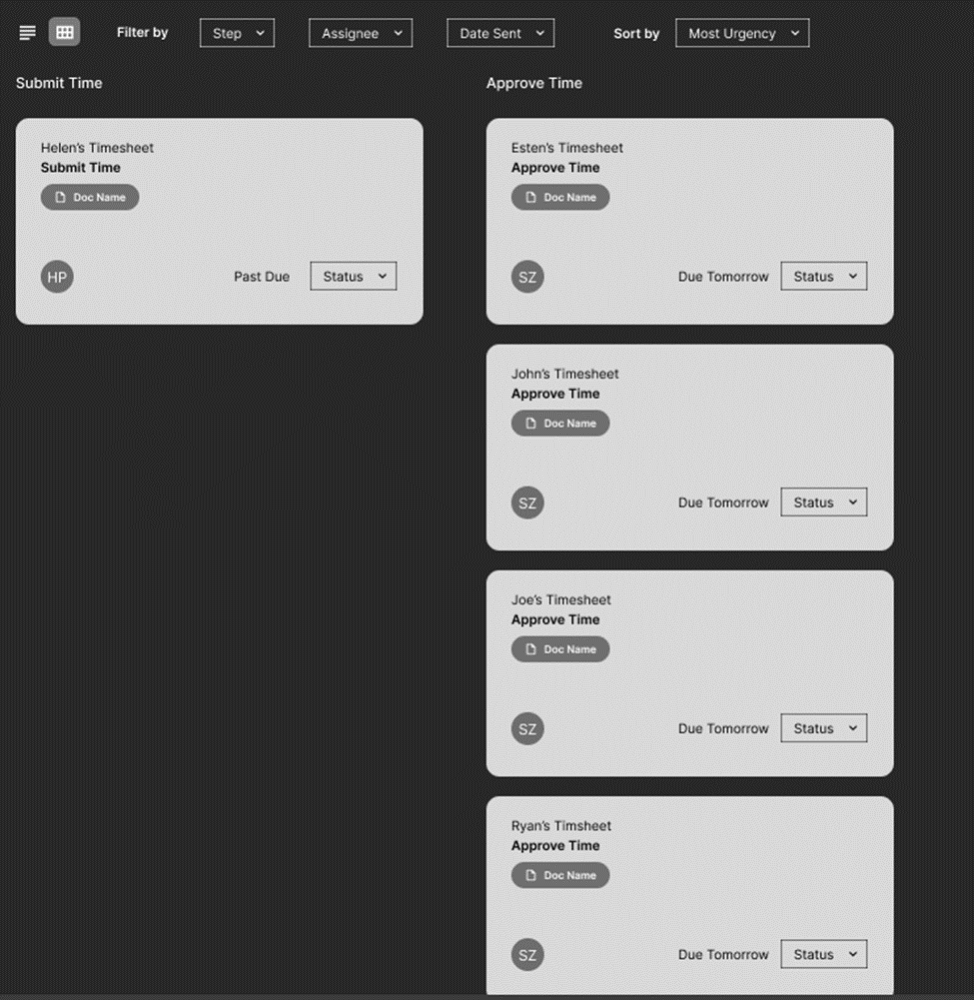
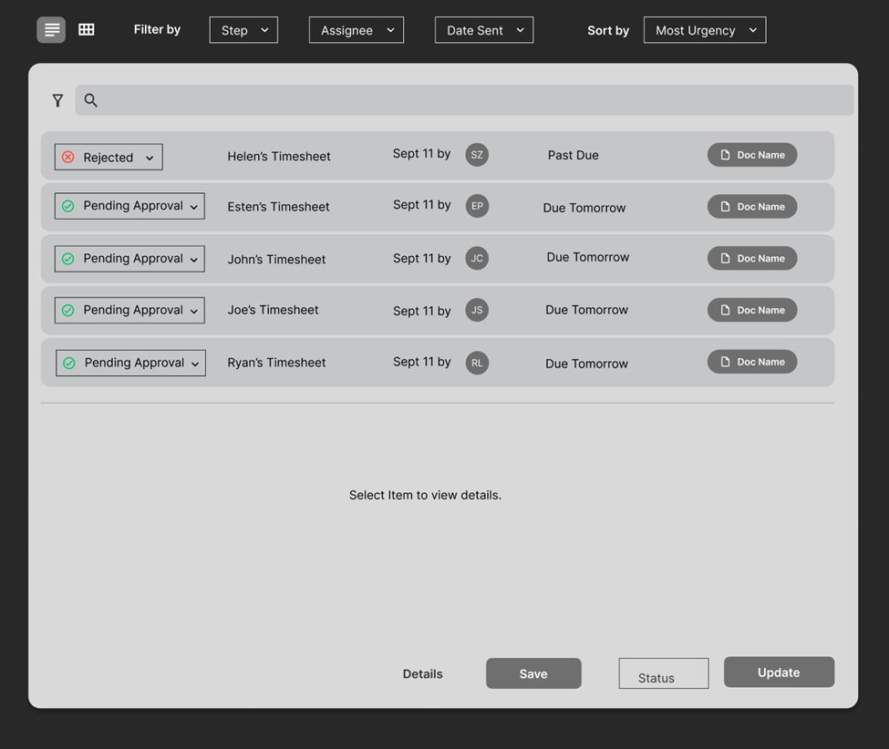
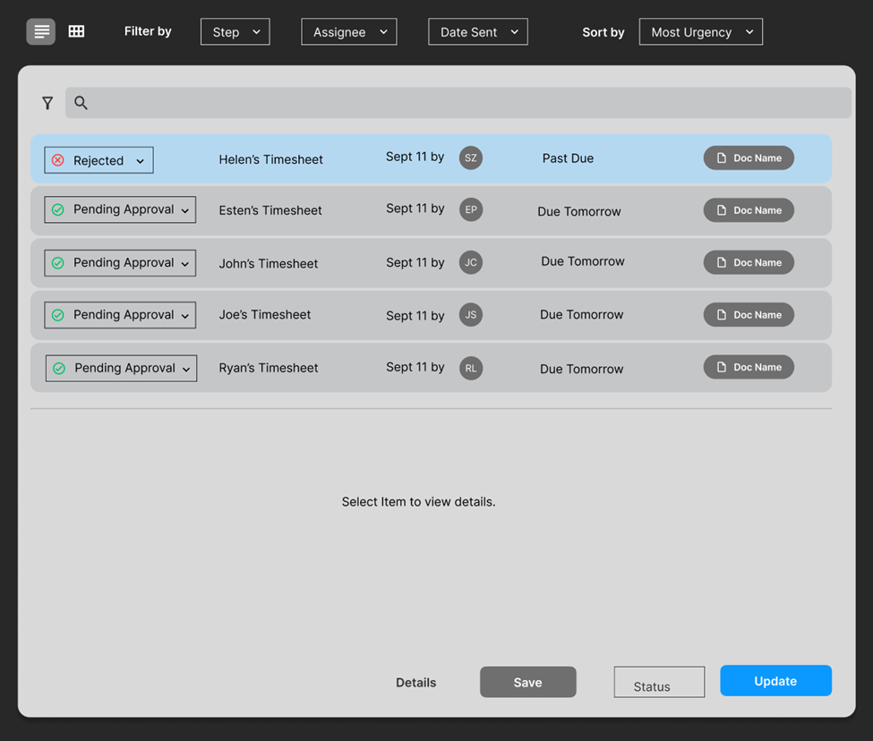

# Workflow coding assessment

This project defines a coding assessment for UISG. It's copied from a [Remix template](https://github.com/remix-run/examples/tree/main/sharing-loader-data). The readme for the original template is below this one. 

## Overview

In this exercise, you will build pages for the "workflow" section of our application. Workflow serves a similar purpose to ticketing systems like Jira, but it's fully integrated with our broader application. So tools used to work on a given ticket can be accessed on the same pages used to track them.

Workflow tracks multi-step, collaborative processes. At each step in the process, the item is assigned to a specific person. The assignee can use other tools within the application to work on that item and push it onto the next step.  This example

## Functional Requirements

The screenshots below show two different views (created in Figma) of the same data. Please recreate these pages as close to pixel-perfect as possible. You do not need to implement every interactive control shown, just those specified below. Data for these pages will be provided.

### Page 1 - Card View

Each card represents an item, they are sorted into columns according to the current required action.  
- Implement dropdowns at the top of the page to filter and sort the cards.
  - Filter options can be sourced from the data. 
  - 'Sort by' should include "Most Urgent," "Least Urgent," and "Assignee."  (Assignee is alphabetical.)
- Assume the current date is 9/12/2024 to render the relative date descriptions ("Past Due," "Due Tomorrow").

### Page 2 - List View

- Implement the radio icons at the top left to switch between the card view and this one.
- This view displays a subset of the same data.
- The filter and sorting controls should also affect this view.

•	Clicking a row should change the text in below to refer to the selected item. (Normally, these panels would either contain further information about the item, or controls to complete the required task.) The text in the placeholders should indicate which item was clicked. E.g. “Showing details of Helen’s Timesheet”

## Technical Requirements

Start by cloning this repo. It's a copy of a [Remix](https://remix.run/) template, which lays out how to share data between routes. Follow the pattern from the template to load the same data into the two different views. The card view and list view should be child routes of the same parent route. You can delete most of the template code once your routes are established.

You don't need a deep understanding of Remix to complete this, and you won't be evaluated on any other Remix concepts.

app/data.server.ts contains a function that returns a Promise to the data. Use this function to stand in for an API call that fetches the data.

Outside of Remix (and React itself), you are free to use whatever tools and libraries you see fit. Icons in the Figma designs are from Material UI.

Please submit both:
•	A video of your completed page demonstrating the required functionality.
•	A link to your Github repo.

# Sharing Loader Data

Sometimes you have data loaded in one route and you want to access that data in another route's component that's active on screen. You can do this via the `useMatches` hook.

## Preview

Open this example on [CodeSandbox](https://codesandbox.com):

## Example

This is a simple "workshop" app which has a "user" and a list of workshops. The user is loaded in the root loader and needed in the index route. The workshops are loaded in the workshops loader and then used in the individual workshop routes.

- [app/root.tsx](./app/root.tsx) - This loads the user
- [app/routes/\_index.tsx](./app/routes/_index.tsx) - This accesses the root loader data to display the user's name
- [app/routes/workshops.tsx](./app/routes/workshops.tsx) - This loads the workshops to display them in a list of links
- [app/routes/workshops/$workshopId.tsx](./app/routes/workshops/$workshopId.tsx) - This accesses the workshops loader data to display the workshop details

## Related Links

- [`useMatches`](https://remix.run/hooks/use-matches)

## Notes:

- The `app/routes/workshops/$workshopId.tsx` route has a loader in it to determine whether the workshop exists. This is important and does not defeat the purpose of sharing the data. The loader runs on the server and we benefit by sharing the data because we don't have to send the data to the client.
- A future version of Remix will provide an `id` on the `matches` which will make it easier to determine which match you want to access.
- You could create a custom hook for accessing specific matches and add type assertion functions to ensure type safety rather than use `as` casting.
